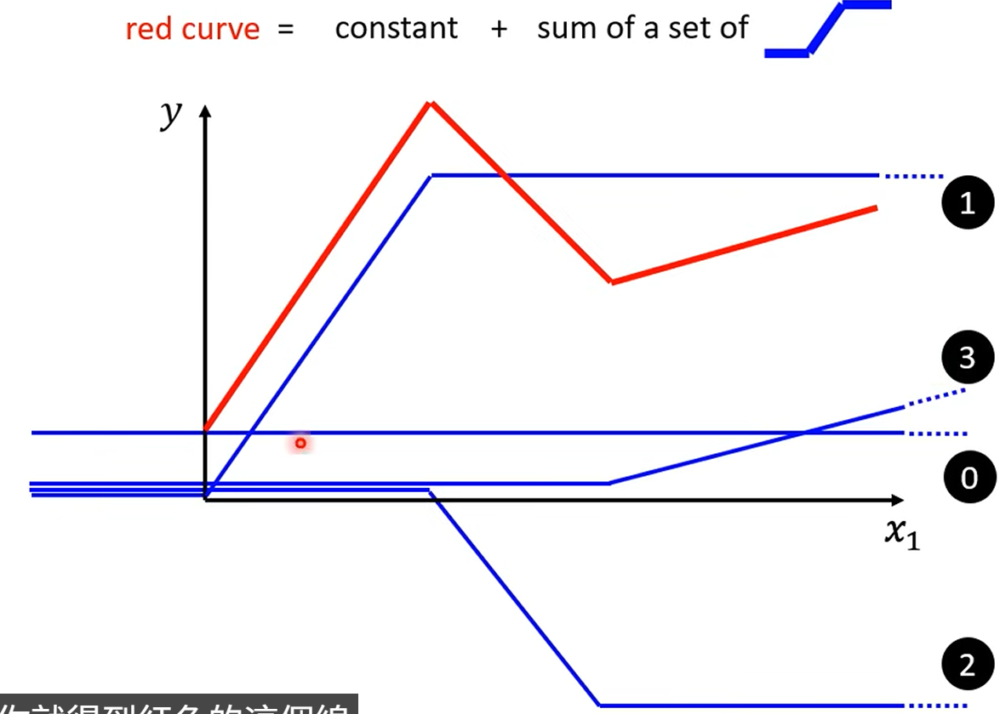

# Regression: The function outputs a scalar

# Classification: Given options, the function outputs the correct one

# Structured Learning: creat something with structure

## 机器学习找方程的三个步骤

### 1. Function

with Unknown Parameters

eg. y = b + w * x  (w and b are unknown parameters)

### 2. Define Loss

From training data

label 正确的数值

### 3. Optimization

Gradient Descent

learning rate: how fast to learn (step length)

hyperparameters: parameters that are not learned from data, but set before training (e.g., learning rate, number of layers, etc.)

w_1 = w_0 - learning_rate * dL/dw


## Linear model are too simple

老师用了youtube的例子，一开始用

y = w * x + b

后面改成用前7天的数据乘以各自的权重

y = w_1 * x_1 + w_2 * x_2 + ... + w_7 * x_7 + b

然后改成14天、28天，56天，结果提升不高了，所以线性模型就被限制了。


开始尝试更复杂的函数：如下图




而这个蓝色的函数就可以用 sigmoid 函数来表示，sigmoid 函数的公式是：

```
 
y = c(1 / (1 + e^-(b+wx_1)))

  = c sigmoid(b + wx_1)
```

## Back to ML system

Loss
-> Loss is a function of the parameters (w, b, c, ...)
-> Loss means how good a set of values is

θ* = argmin_θ Loss(θ)
- (randomly) initialize parameters θ
- caculate 微分 得到向量g (gradient) g=∇_θ Loss(θ)
- update parameters θ = θ - learning_rate * g

现在我们就是一个batch 一个batch 的去更新参数，算出gradient，然后更新参数

更新一次参数是一个 update

一个 epoch是 对所有的训练数据都更新了一次参数


然后我们还可以把每一个 x塞进 Relu or sigmoid 里面得到的 a再塞进 Relu or sigmoid，这样就可以看作是 “一层”

所以就得到了一个 multi-layer neural network

many layers means deep,so this is called deep learning
