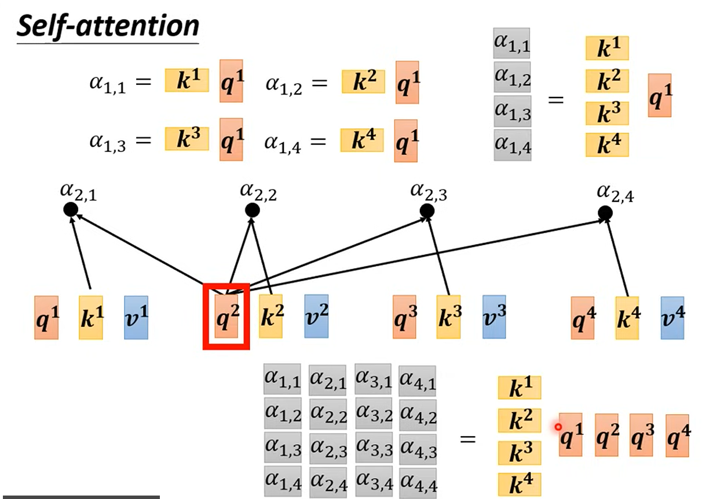
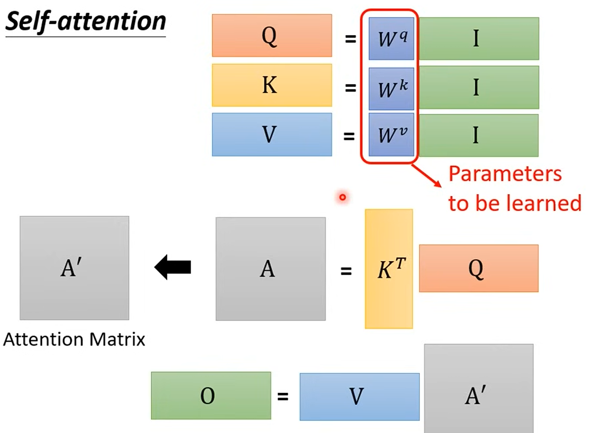

# Sophisticated input(复杂输入)

文字处理: 每次输入的文字长度都不同，输入的就是一个vector set,而且每次的set大小不同

- One-hot encoding
- Word embedding

# output?

1. Each vector has a label (4 inputs, 4 labels)
- Example:
- - 词性标注，给每个词标注词性

2. The whole sequence has a label
- Example:
- - 情感分析，给整句话标注情感

3. Model decides the number of labels itself.
- Example:
- - 机器翻译，输入一段文字，输出另一段文字，输出的长度不一定和输入的长度一样
(seq2seq)

# 先讲讲第一种——Sequence labeling

eg. I saw a saw.

第一个saw和第二个saw对于模型来说是完全一样的词语，模型会误判，但是我们怎么让模型能区分这两个saw呢？ 所以我们让模型去看上下文，给模型一个看上下文的能力。

所以我们引入 self-attention

把 Fully connected network 和 self-attention结合起来，混合使用。变成Transformer

# Self-attention

输入是 hidden layer的 output
希望从 a1,a2,a3,....,an 里面产生b1,b2,b3,...,bn,里面的每个b都是考虑了所有的a的影响的。

step1. Find the relevant vectors in a sequence

step2. Dot-product 得到一个 scalar 

query vector q, key vector k, value vector v

通过Wqa1 得到 query vector q1

通过wka2 得到 key vector k2

q1 dot k2 得到一个 scalar, 这个scalar表示a1和a2的相关性 (以此类推)

然后b1 = Σ (q1 dot ki) * vi (其中v的作用是把相关性传递给下一层)

上图中 左侧为A ， 右侧为 KT dot Q = QKT

对A softmax之后就可以得到A’

所以[b1,b2,b3,...,bn]就是 V*A’ (V 是 [v1,v2,v3,...,vn] )

Q可以理解为: 我想要的东西
K可以理解为: 我这里有什么东西
V可以理解为: 如果匹配上了，我实际要交给你的信息

# multi-head self-attention

相关这个东西有很多不同的角度

所以多头其实就是W矩阵不同的两个attetion

# Positional Encoding

- No position information in self-attention