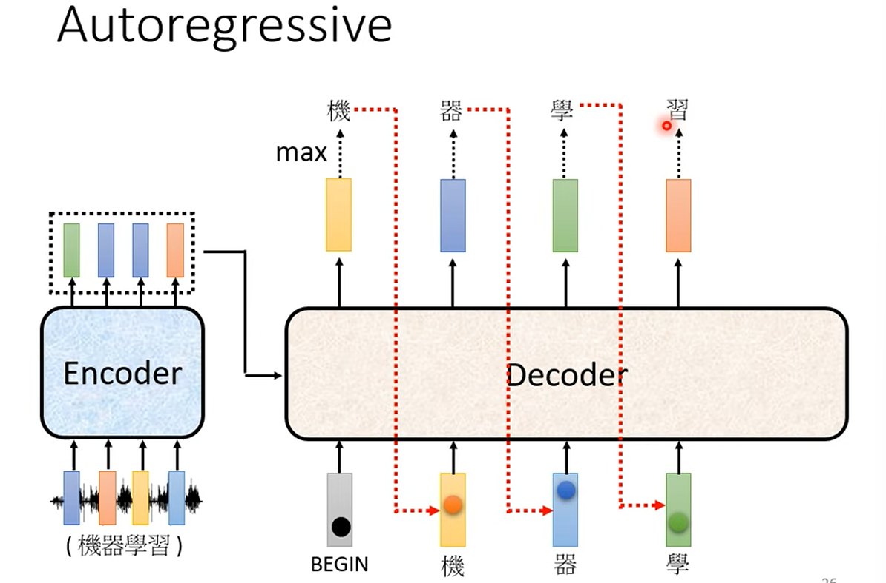

# Transformer (upper)

一个 seq2seq 的 model

Input a sequence , output a sequence

-  Speech recognition
-  Machine translation

## Seq 2 seq for Chatbot

QA can be done by seq2seq model

Question + Context -> Seq2Seq -> Answer

## Encoder

给一排向量输出另外一排向量

RNN \ CNN 都可以做到等

Transformer的Encoder就用的是Transformer block,通常有多个block

一个block通常是 -> self-attention-> FC -> ...

Transformer里面再self-attention之后，还要加上原来的自己，叫做 residual connection

再进行 normalization,  不过这里是 layer normalization, 不是 batch normalization

把输入的向量计算mean和 std， xi' = (xi - mean) / std

然后再Residual之后，再layernorm一次

# Decoder

## Auto-regressive decoder

Encoder的输出进入Decoder

用一个特殊的符号BOS 的special token代表开始 

如果是 One-hot 的话，这个向量的大小就是词表的大小

把自己前面的输出当作是后面的输入

不过Decoder的self-attention 上面会有masking, 不能看到后面的输出

然后还准备一个 "stop token" 代表结束

## NAT(None auto-regressive Transformer)

一次性输出

- How to decide the output length for NAT decoder?
- - Another predictor for output length
- - Output a very long sequence,ignore tokens after END
- Advantage: Faster parallel,controllable output length

## Cross attention

接受来自 Encoder的输出和Decoder的输入

把Decoder里面的 hiddenstate 作为 query, Encoder的输出作为 key 和 value，从Encoder里面拿出来资讯，得到cross attention的输出

## Training

每个输出总的Cross Entropy 最小，就是训练的目标

训练的时候会给decoder看正确答案(teacher forcing)

## Copy Mechanism

有些时候不需要自己写一些文字，而是从用户的输入里面copy一些东西出来

TTS 训练的时候加入噪音，让decoder有随机性
