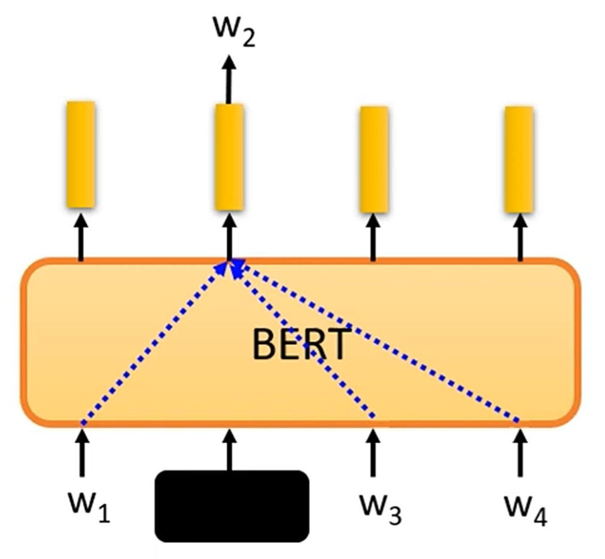
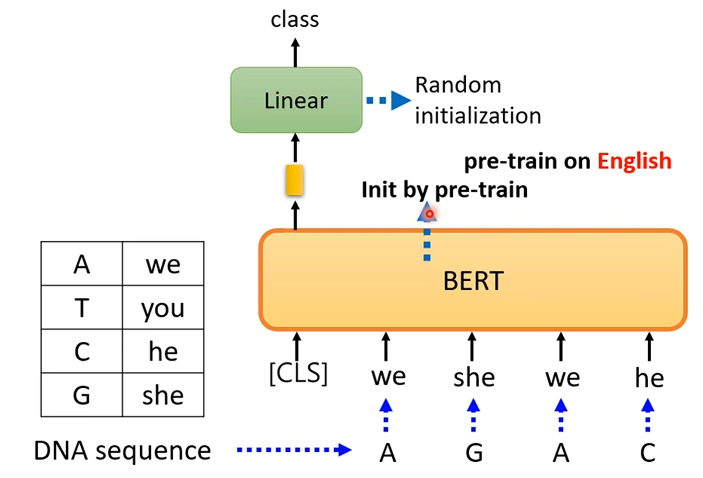

# Self-Supervised learning

- ELMO
- BERT
- ERNIE
- BigBird
 

BERT  340M parameters

- Supervised

input -> x -> model -> y  <- - - yhat  

- self-supervised

把资料分成两半，输入一半，输出另一半，用一半作为输入进入model，预测另一半的内容，作为监督信号.

## Masking input

把输入的部分随机的mask掉

- 把token编程一个special mask token
- 随机把一个字变成另外一个字

把盖住的向量做Linear projection，然后 softmax，得到一个概率分布，和原本的字做cross entropy loss

## Next Sentence Prediction

[CLS] w1 w2 [SEP] w3 w4

整个塞进去，CSL生成的token的向量，做一个linear projection，判断两个句子是不是连贯的，做一个二分类的cross entropy loss (二元分类)

任务集
## GLUE Benchmark
General Language Understanding Evaluation

## HOW TO USE BERT - Case 1

当前任务

- Input : Sequence
- Output : Class

- Example: Sentiment Analysis 
- This is good -> Positive

## HOW TO USE BERT - Case 2

- Input: Sequence
- Output: Sequence

- Example: POS tagging(Part-of-Speech tagging)

## HOW TO USE BERT - Case 3

- Input: two sequences
- Output: Class

- Example: Natural Language Inference (NLI)
(立场分析等等)

Bert输入两个句子  [CLS] w1 w2 [SEP] w3 w4
只看CLS的输出去判断

## HOW TO USE BERT - Case 4

- Extraction-based Question Answering (QA)

- Document: D = {d1， d2, d3, d4, dN}
- Query: Q = {q1, q2, q3, q4, qM}

D ->        ->s
Q ->  model ->e

output two integers (s,e)

Answer:  A = {d_s, d_{s+1}, d_{s+2}, d_{e-1}, d_e}

用Bert-pretrained

[CLS] q1 q2 [SEP] d1 d2 d3

进入到BERT 里面

把d生成的向量和答案生成向量dot 、 结束向量 dot ， 得到最高的分数之间的token 就是结果

## Why does bert work?

四个字输入 BERT ， 得到的四个embedding， 他们都代表了原来的那个字

Context is considered

(eg.  吃苹果的果 和 苹果手机 里面的果的embedding不一样)

现在把一个去掉，得到这样的结果  (contextualized word embedding)

- Applying BERT to protein,DNA,music classification

把 DNA sequence 对应到一个字母上

## Multilingual BERT

做多种语言的填空题

- Training in English can help in other languages!?

不同的语言的embedding很相似 

# GPT series

Predict next token

拿一笔资料一个句子,很大的参数, 是类似于 Transformer 的decoder

'few-shot learning'  (少量样本学习)

举一反三, 很狂的 set 