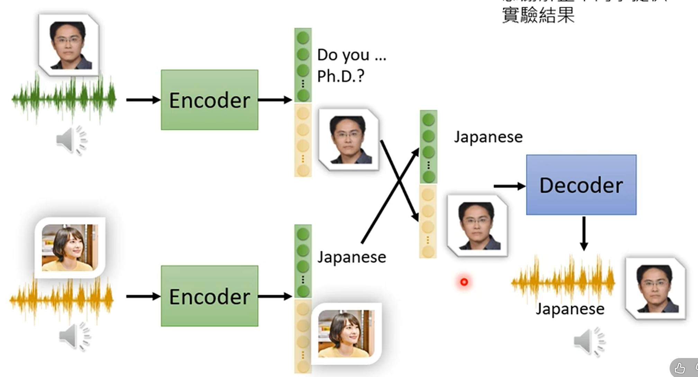

# Self-supervised learning Framework

data -> model  (pre-train)

把self-supervised learning做一点调整就可以用在不同的任务上

# Outline

# autoencoder

auto encoder内有 encoder 和 decoder

输入 -> nn encoder -> vector -> nn decoder -> 输出

输入输出 as close as possible

vector 可以叫 embedding, representation code [new feature for downstream tasks] (or bottleneck)(因为 vector的维度比输入输出小很多)

# why autoencoder

发现类似图片的变化类型是有限的，例如一个3x3的图片，可能只需要几个数字就可以描述图片

# De-noising autoencoder

给图片加上噪音再进入 encoder, decoder再输出去除噪音的图片

# Feature disentanglement

input -> encoder -> code -> decoder -> output
                      |
                      v
            这个下面包含了很多的信息

**application: voice conversion** : Speaker A说话的声音 -> encoder -> code -> decoder -> Speaker B说话的声音

# Anomaly detection 

- given a set of training data {x1,x2,...,xn}

- detecting input x is similar to training data or not.

- Fraud detection
- Network intrusion detection
- Cancer detection
- - -
难点是训练的时候一般很难找到 异常的训练资料，所以一般就只用正常的训练资料来训练 autoencoder, 然后用训练好的 autoencoder去检测异常数据。

