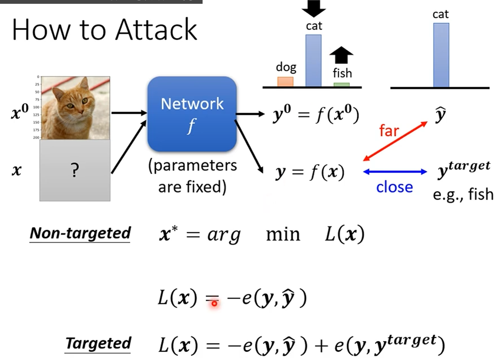

# HOW TO ATTACK!?
**example of attack**:

之前我们有了训练图片识别的模型

现在给图片[x1,x2,...,xn]加入一个噪声 [dx1,dx2,...,dxn]，使得模型对加入噪声后的图片[x1+dx1,x2+dx2,...,xn+dxn]的预测结果发生改变。 攻击就成功了

--------------------------------------------------------------------------------------------------
Non-targeted attack: 让模型预测结果发生改变即可，不需要指定预测结果
targeted attack: 让模型预测结果发生改变，并且指定预测结果为某个类别
---

---

总而言之就是 x0 与 x 越相似越好

y 和 yhat越不相似越好
y 和 y_target 越相似越好

# 图片之间的相似度可以用 L2 距离来衡量 (L2-Norm)

- L2-norm

d(x0,x) = ||Δx||_2 = 平方和

- L-infinity
d(x0,x) = ||Δx||_∞ = max{|Δx1|, |Δx2|, ..., |Δxn|}

# Attack Approach

$$ x^* = arg  min(L(x)) $$

-> Gradient Descent  同时还要考虑x和x0的相似度约束

update x之后，如果超出了约束范围，就要把x投影回约束范围内

# White-box v.s. Black-box

我们上面的方法是白盒攻击，知道模型的参数和结构，因为我们可以计算梯度，所以可以直接用梯度下降法来更新x

但是模型很多时候是参数非公开的黑盒模型，这时候我们就不能直接计算梯度了

- Black box attack is possilbe

训练一个 Proxy model 来近似原始模型，然后用 Proxy model 来计算梯度，更新x

攻击Proxy model的同时，原始模型的预测结果也会发生改变

# backdoor in model

数据集投毒，有些训练集的标签被留了后门，导致会出问题

# Passive Defense

- 对图片轻微的smoothing，模糊化处理，降低模型对噪声的敏感性

但是只能防止别人不知道的情况

- 加上随机性，例如把 resize,padding 等随机排列排列

# Proactive Defense

- Adversarial Training

在训练的时候就对样本进行处理，变成被攻击的数据，然后再把这些被攻击的数据加入训练集，重新训练模型，这样模型就会对攻击有一定的鲁棒性

不断找漏洞不断Trainning

很吃运算资源